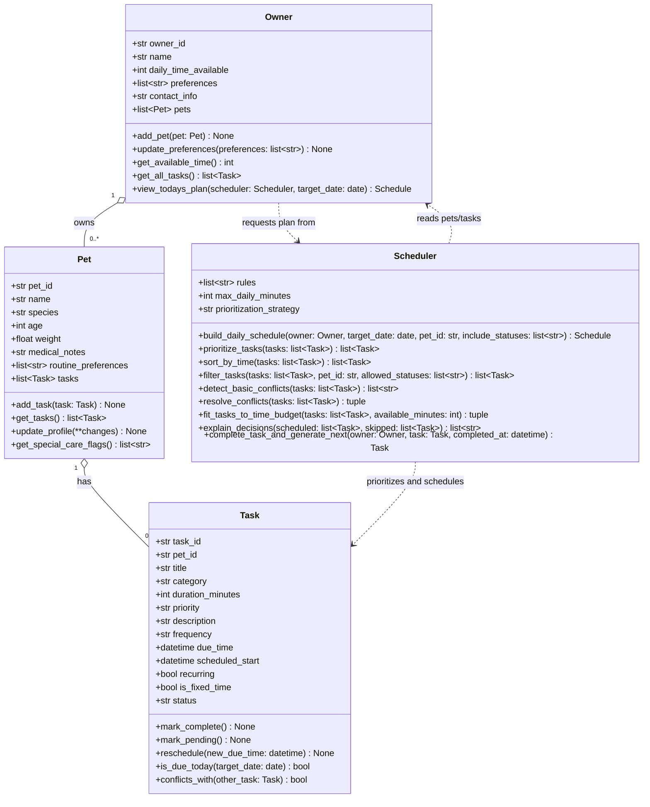

# PawPal+ UML Design

This file includes the rendered UML image and the Mermaid source used to generate it.

## Rendered Diagram

## Mermaid Source

```mermaid
classDiagram
    class Owner {
        +str owner_id
        +str name
        +int daily_time_available
        +list~str~ preferences
        +str contact_info
        +list~Pet~ pets
        +add_pet(pet: Pet) None
        +update_preferences(preferences: list~str~) None
        +get_available_time() int
        +get_all_tasks() list~Task~
        +view_todays_plan(scheduler: Scheduler, target_date: date) Schedule
    }

    class Pet {
        +str pet_id
        +str name
        +str species
        +int age
        +float weight
        +str medical_notes
        +list~str~ routine_preferences
        +list~Task~ tasks
        +add_task(task: Task) None
        +get_tasks() list~Task~
        +update_profile(**changes) None
        +get_special_care_flags() list~str~
    }

    class Task {
        +str task_id
        +str pet_id
        +str title
        +str category
        +int duration_minutes
        +str priority
        +str description
        +str frequency
        +datetime due_time
        +datetime scheduled_start
        +bool recurring
        +bool is_fixed_time
        +str status
        +mark_complete() None
        +mark_pending() None
        +reschedule(new_due_time: datetime) None
        +is_due_today(target_date: date) bool
        +conflicts_with(other_task: Task) bool
    }

    class Scheduler {
        +list~str~ rules
        +int max_daily_minutes
        +str prioritization_strategy
        +build_daily_schedule(owner: Owner, target_date: date, pet_id: str, include_statuses: list~str~) Schedule
        +prioritize_tasks(tasks: list~Task~) list~Task~
        +sort_by_time(tasks: list~Task~) list~Task~
        +filter_tasks(tasks: list~Task~, pet_id: str, allowed_statuses: list~str~) list~Task~
        +detect_basic_conflicts(tasks: list~Task~) list~str~
        +resolve_conflicts(tasks: list~Task~) tuple
        +fit_tasks_to_time_budget(tasks: list~Task~, available_minutes: int) tuple
        +explain_decisions(scheduled: list~Task~, skipped: list~Task~) list~str~
        +complete_task_and_generate_next(owner: Owner, task: Task, completed_at: datetime) Task
    }

    Owner "1" o-- "0..*" Pet : owns
    Pet "1" o-- "0..*" Task : has
    Owner ..> Scheduler : requests plan from
    Scheduler ..> Owner : reads pets/tasks
    Scheduler ..> Task : prioritizes and schedules
```